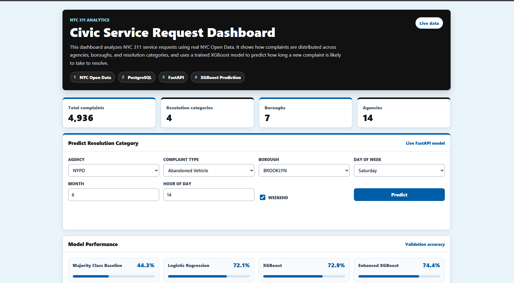
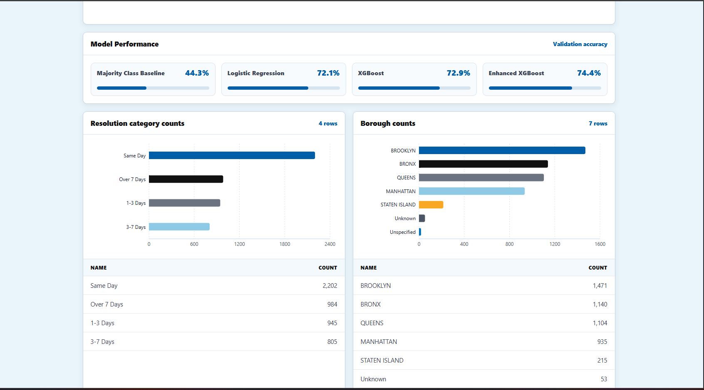
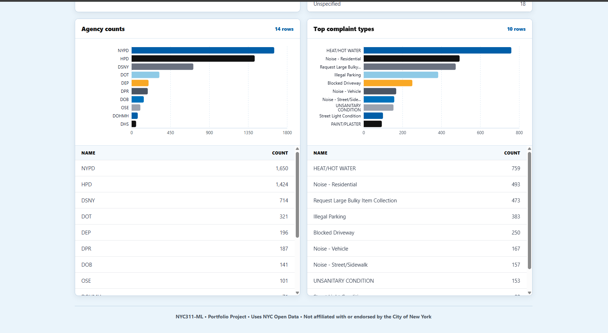
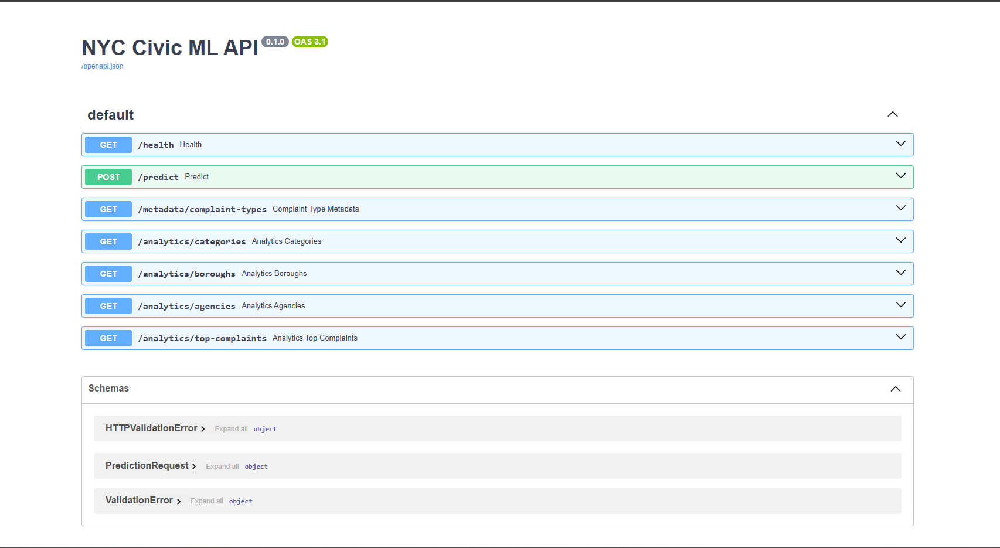

# NYC311-ML

## Live Demo

[https://nyc311.pulse-forge.com](https://nyc311.pulse-forge.com)

---

## Overview

NYC311-ML is a full-stack analytics and machine learning project built using real NYC Open Data.

The project analyzes NYC 311 service requests, provides operational insights through an interactive dashboard, and uses machine learning to predict how long a complaint is likely to take to resolve.

What started as a simple machine learning experiment eventually grew into a complete application with a PostgreSQL database, FastAPI backend, React frontend, Docker support, and a deployed prediction engine.

The goal wasn't just to train a model. The goal was to build a complete analytics platform around real-world data.

---

## Why I Built This Project

After completing a machine learning project in bioinformatics, I wanted to work on something closer to the kinds of analytics problems organizations deal with every day.

NYC 311 data seemed like a good fit because:

* It's public and easy to access
* It's large enough to be interesting
* Most people immediately understand what the data represents
* It contains real operational information

I also wanted a project that would allow me to practice more than just machine learning.

This project became an opportunity to combine:

* Data Engineering
* SQL
* PostgreSQL
* Machine Learning
* API Development
* Frontend Development
* Docker

into a single application.

---

## What The Application Does

The dashboard allows users to:

* Explore NYC 311 complaint activity
* Analyze complaint distributions across agencies and boroughs
* View historical complaint-volume and resolution-time trends
* Compare machine learning model performance
* Generate resolution predictions for new complaints

The prediction engine uses a trained XGBoost model to estimate how long a complaint is likely to take to resolve.

---

## Dashboard and Prediction Engine



The main dashboard shows total complaints, resolution categories, boroughs, and agencies at a glance. The tech stack pipeline — NYC Open Data → PostgreSQL → FastAPI → XGBoost — is displayed as labeled steps beneath the title.

Users can generate a resolution prediction by entering:

* Agency
* Complaint Type
* Borough
* Day of Week
* Month
* Hour of Day

The application returns a predicted resolution category and confidence score using the deployed XGBoost model.

Example:

```text
Agency: HPD
Complaint Type: HEAT/HOT WATER
Borough: Brooklyn

Prediction:
3–7 Days

Confidence:
64%
```

---

## Analytics Dashboard



The dashboard includes:

* Resolution category distributions
* Borough-level complaint analysis
* Agency-level complaint analysis
* Top complaint types
* Monthly sampled complaint-volume trend analysis
* Monthly average resolution-time trend analysis
* Machine learning model comparisons

All analytics are generated from live PostgreSQL data through the FastAPI backend.

No dashboard data is hardcoded.

Historical trend analysis is implemented in the dashboard using Recharts line charts. The trend panels show monthly sampled complaint volume and monthly average resolution time from backend analytics endpoints.

---

## Agency and Complaint Breakdown



Detailed bar charts and scrollable data tables show complaint counts by agency and by complaint type. NYPD (1,650) and HPD (1,424) lead by agency volume, while HEAT/HOT WATER (759) and Noise - Residential (493) are the top complaint categories.

---

## Machine Learning Results

Several models were evaluated for predicting complaint resolution categories.

| Model                   | Accuracy |
| ----------------------- | -------: |
| Majority Class Baseline |    44.3% |
| Logistic Regression     |    72.1% |
| XGBoost                 |    72.9% |
| Enhanced XGBoost        |    74.4% |

The Enhanced XGBoost model was selected for deployment.

Target categories:

* Same Day
* 1–3 Days
* 3–7 Days
* Over 7 Days

---

## API Documentation



The backend API is built with FastAPI and includes:

### Health

```http
GET /health
```

### Analytics

```http
GET /analytics/categories
GET /analytics/boroughs
GET /analytics/agencies
GET /analytics/top-complaints
GET /analytics/trends/volume
GET /analytics/trends/resolution
```

### Metadata

```http
GET /metadata/complaint-types
```

### Prediction

```http
POST /predict
```

Swagger documentation is available through FastAPI and allows all endpoints to be tested directly from the browser.

---

## Architecture

```text
NYC Open Data
       ↓
Python ETL
       ↓
Data Cleaning
       ↓
PostgreSQL
       ↓
FastAPI
       ↓
React Dashboard
       ↓
XGBoost Predictions
```

The application follows a fairly simple workflow.

Data is downloaded from NYC Open Data, cleaned and transformed using Python, loaded into PostgreSQL, exposed through FastAPI, and visualized in React.

Machine learning predictions are served through the same API layer.

In production, the app sits behind a Caddy reverse proxy that handles HTTPS. The frontend is served at the main domain, and API traffic goes to the backend under `/api`.

---

## Technology Stack

### Backend

* Python
* FastAPI
* SQLAlchemy
* PostgreSQL

### Machine Learning

* Scikit-Learn
* XGBoost
* Joblib

### Frontend

* React
* TypeScript
* Vite
* Recharts

### Infrastructure

* Docker
* Docker Compose

---

## Running Locally

From a fresh clone, make sure the frontend has a local environment file:

```ini
# frontend/.env
VITE_API_BASE_URL=http://localhost:8001
```

Then run the full stack with Docker Compose:

```bash
docker compose up --build
```

The base Compose file is shaped for production, where Caddy connects to the app on the external `edge` network. For local development, `docker-compose.override.yml` is picked up automatically and publishes the ports you need.

The dashboard will be available at:

```text
http://localhost:8080
```

The backend API will be available at:

```text
http://localhost:8001
```

FastAPI docs will be available at:

```text
http://localhost:8001/docs
```

---

## What I Learned

One thing this project reinforced is that machine learning is only one part of the process.

Most of the work involved:

* Cleaning data
* Designing database tables
* Building APIs
* Connecting systems together
* Creating a usable interface

Training the model was actually one of the easier parts.

Building the application around the model was where most of the work happened.

---

## Future Improvements

Potential future enhancements include:

* Automated data refresh jobs
* Geospatial mapping
* Time-series forecasting
* ~~Cloud deployment~~ (deployed to DigitalOcean)
* Additional machine learning features

---

## Disclaimer

NYC311-ML is a portfolio project built using NYC Open Data.

This project is not affiliated with, endorsed by, or operated by the City of New York.

---

## Author

Gregory Luna
